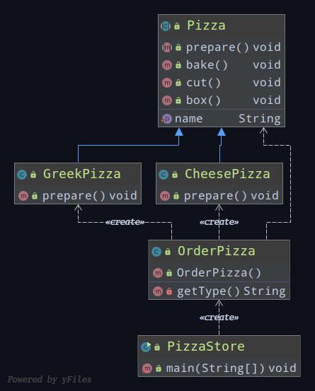
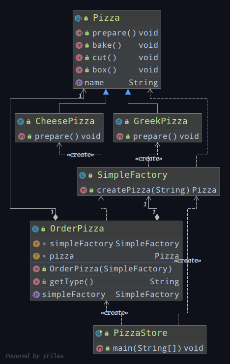
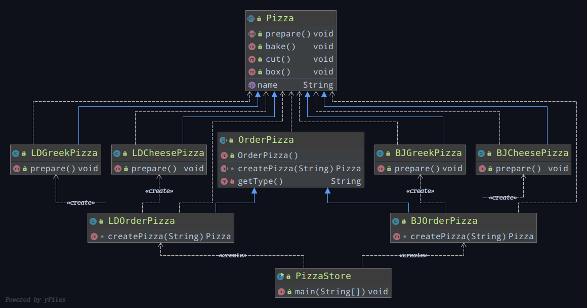
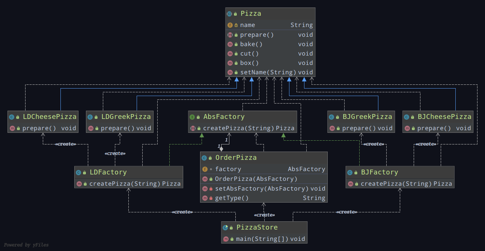

# 工厂模式（创建型）

## 案例需求

披萨项目：便于披萨种类扩展，便于维护

1. 披萨有很多种类
2. 披萨的制作有：prepare、bake、cut、box
3. 完成披萨店的订购

## 传统方式

### 类图

### 优点

好理解，简单易操作

### 缺点

违反了设计模式的**开闭原则**，要新增一个新的披萨种类，需要修改`OrderPizza`类

### 改进思路

把创建披萨对象封装进一个类中，有新的披萨种类时，只需要修改该类，其他创建披萨对象的代码就不需要修改了

## 简单工厂模式

### 说明

1. 简单工厂模式是由一个工厂对象决定创建出哪一种产品类的实例

   简单工厂模式是工厂模式家族中最简单实用的模式

2. 简单工厂模式：定义了一个创建对象的类,由这个类来封装实例化对象的行为(代码)

3. 在软件开发中，当我们会用到大量的创建某种、某类或者某批对象时,就会使用到工厂模式

### 类图

## 工厂方法模式

### 新需求

客户在点披萨时，可以点不同口味的披萨

比如 ：北京的起司披萨、北京的希腊披萨或者是伦敦的起司披萨、伦敦的希腊披萨

### 说明

1. 将披萨项目的实例化功能抽象成抽象方法，在不同的口味点餐子类中具体实现

2. 定义了一个创建对象的抽象方法，由子类决定要实例化的类

   工厂方法模式将对象的实例化推迟到子类

### 类图

## 抽象工厂模式

### 说明

1. 定义了一个interface用于创建相关或有依赖关系的对象簇,而无需指明具体的类

2. 将简单工厂模式和工厂方法模式进行整合

3. 从设计层面看，抽象工厂模式就是对简单工厂模式的改进(或者称为进一步的抽象)

4. 将工厂抽象成两层，AbsFactory（抽象工厂）和具体实现的工厂子类

   程序员可以根据创建对象类型使用对应的工厂子类

   这样将单个的简单工厂类变成了工厂簇,更利于代码的维护和扩展

### 类图

## 工厂模式在JDK-Calendar的应用

JDK 中的 `Calendar` 类中，就使用了简单工厂模式

## 小结

1. 工厂模式的意义
   将实例化对象的代码提取出来,放到一个类中统一管理和维护，达到和主项目的依赖关系的解耦，从而提高项目的扩展和维护性
2. 三种工厂模式 （简单工厂模式、工厂方法模式、抽象工厂模式）
3. 设计模式的依赖倒置原则

>创建对象实例时不要直接new类，而是把这个new类的动作放在一个工厂的方法中并返回
>变量不要直接持有具体类的引用
>不要让类继承具体类，而是继承抽象类或者是实现interface(接口)
>不要覆盖基类中已经实现的方法