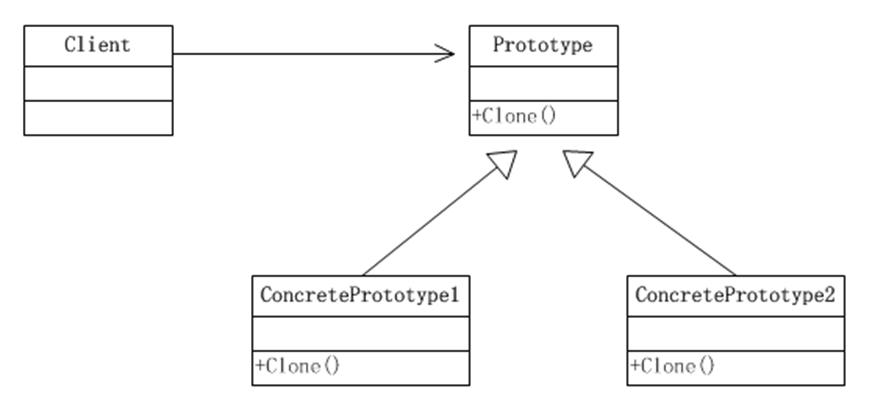
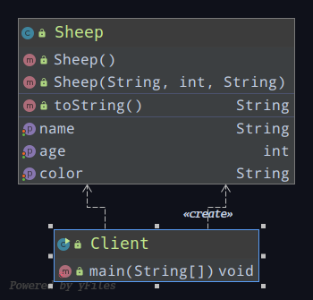
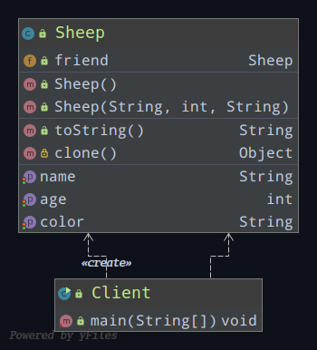
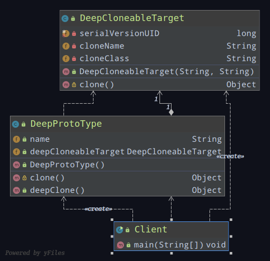
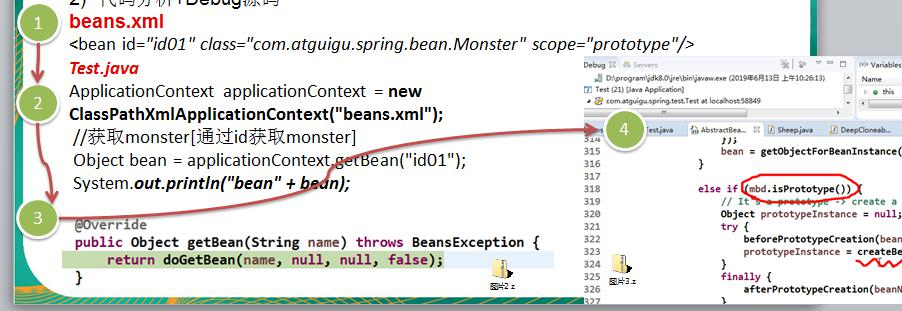

# 原型模式（创建型）

## 说明

1. 原型模式是指：用原型实例指定创建对象的种类，并且通过拷贝这些原型，创建新的对象
2. 工作原理是通过将一个原型对象传给那个要发动创建的对象，这个要发动创建的对象通过请求原型对象拷贝它们自己来实施创建，即：对象.clone()


### 原理结构图




#### 说明

1. Prototype：原型类，声明一个克隆自己的接口
2. ConcretePrototype：具体的原型类，实现一个克隆自己的操作
3. Client：让一个原型对象克隆自己，从而创建一个新的对象(属性一样)


## 案例需求

现在有一只羊 tom，姓名为：tom,，年龄为：1，颜色为：白色

请编写程序创建和tom羊属性完全相同的 10只羊


## 传统方式

### 类图



### 优点

好理解，简单易操作


### 缺点

1. 在创建新的对象时，总需要重新获取原始对象的属性

   如果创建的对象比较复杂时，效率较低

2. 总需要重新初始化对象，而不是动态地获得对象运行时的状态，不够灵活


### 改进思路

Java 中 Object 类是所有类的根类，Object 类提供了一个clone()方法

该方法可以将一个Java对象复制一份，但是需要实现clone的Java类必须要实现一个接口`Cloneable`

该接口表示该类能够复制且具有复制的能力


## 浅拷贝

### 说明

1. 对于数据类型是`基本数据类型`的成员变量，浅拷贝会直接进行`值传递`，也就是将该属性值复制一份给新的对象

2. 对于数据类型是`引用数据类型`的成员变量，比如说成员变量是某个数组、某个类的对象等，那么浅拷贝会进行`引用传递`，也就是只是将该成员变量的引用值(内存地址)复制一份给新的对象

   因为实际上两个对象的该成员变量都指向同一个实例

   在这种情况下，在一个对象中修改该成员变量会影响到另一个对象的该成员变量值

3. 浅拷贝是使用默认的clone()方法来实现

   `sheep = (Sheep) super.clone();`


### 类图




## 深拷贝

### 说明

1. 复制对象的所有基本数据类型的成员变量值

2. 为所有引用数据类型的成员变量申请存储空间，并复制每个引用数据类型成员变量所引用的对象，直到该对象可达的所有对象

   也就是说，对象进行深拷贝要对整个对象(包括对象的引用类型)进行拷贝


### 实现方式1

重写clone()方法来实现深拷贝


### 实现方式2

通过对象序列化实现深拷贝（推荐）


### 类图




### 方式1核心代码

```Java
/**
 * 深拷贝-方式1：使用clone方法
 */
@Override
protected Object clone() throws CloneNotSupportedException {
    Object deep=null;

    //完成对基本数据类型和String的克隆
    deep=super.clone();

    //对引用类型进行单独处理
    DeepProtoType deepProtoType=(DeepProtoType)deep;
    deepProtoType.deepCloneableTarget=(DeepCloneableTarget) deepCloneableTarget.clone();

    return deep;
}
```


### 方式2核心代码

```Java
/**
 * 深拷贝-方式2：通过对象的序列化（推荐使用）
 */
public Object deepClone(){
    //创建流对象
    ByteArrayOutputStream bos=null;
    ObjectOutputStream oos=null;

    ByteArrayInputStream bis=null;
    ObjectInputStream ois=null;

    try {
        //序列化
        bos=new ByteArrayOutputStream();
        oos=new ObjectOutputStream(bos);

        //当前这个对象以对象流的方式输出
        oos.writeObject(this);

        //反序列化
        bis=new ByteArrayInputStream(bos.toByteArray());
        ois=new ObjectInputStream(bis);

        DeepProtoType copyObj=(DeepProtoType) ois.readObject();

        return copyObj;
    } catch (Exception e) {
        e.printStackTrace();
        return null;
    }finally {
        try{
            bos.close();
            oos.close();
            bis.close();
            ois.close();
        }catch (Exception e1){
            e1.printStackTrace();
        }
    }
}
```


## 注意事项和细节

1. 创建新的对象比较复杂时，可以利用原型模式**简化对象的创建过程**，同时也能够**提高效率**
2. 不用重新初始化对象，而是**动态地获得对象运行时的状态**
3. 如果原始对象发生变化(增加或者减少属性)，其它克隆对象的也会发生相应的变化，无需修改代码
4. 在实现深克隆的时候可能需要比较复杂的代码

5. **缺点**：需要为每一个类配备一个克隆方法，这对全新的类来说不是很难，但对已有的类进行改造时，需要修改其源代码，违背了开闭原则


## 在Spring框架中的应用

Spring框架中bean的创建，就使用了原型模式

